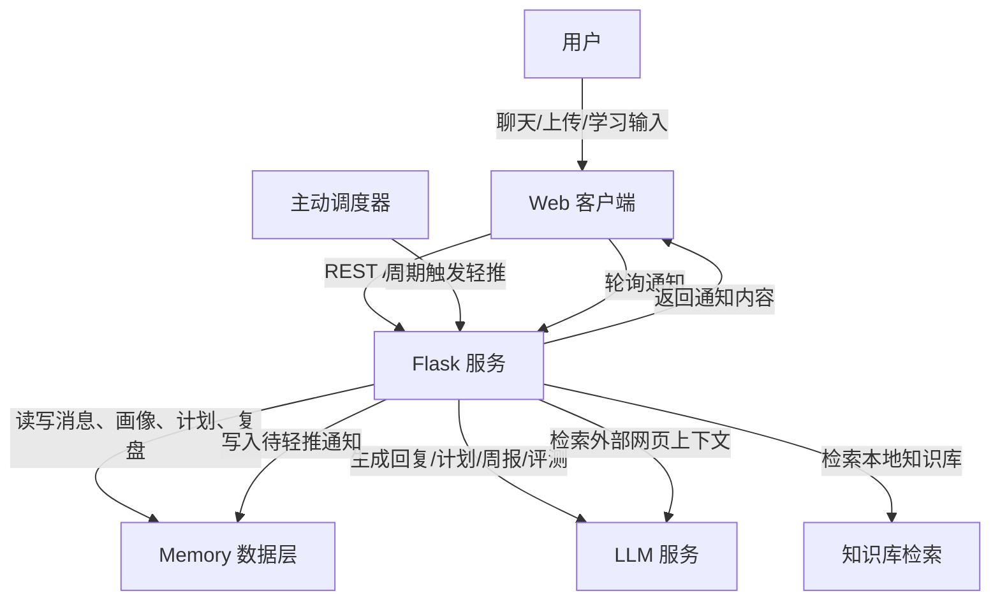

# MindShadow（当前版本）- 产品需求文档（AI 易读版）

**版本**: 1.0.1  
**状态**: 反推完成（基于现网代码）  
**平台**: Web（React）+ Python Flask 服务端  
**目标**: 可用 MVP（可自用、可分享）  
**核心**: 主动式学习搭子 + 学习闭环运营（计划-练习-复盘-周报-评测）

---

## 1. 产品概述（战略层）

### 1.1 核心价值主张
MindShadow 不是“只会回答问题”的聊天机器人，而是围绕学习结果的主动式陪练系统。  
它的价值不只在“答得对”，还在于帮助用户持续学习并形成闭环：
1. 通过对话和知识摄入建立上下文记忆。  
2. 主动轻推用户回流学习。  
3. 用学习计划、复盘模板、周报和评测来持续优化学习策略。  

### 1.2 目标用户与场景
* **目标用户**: 自学备考用户（如教招/考证/语言/职业技能）。  
* **核心痛点**: 学习中断、复错反复、缺少陪练反馈、难以量化进步。  
* **核心场景**:
  * 日常问答与讲解（文字/图片）。  
  * 粘贴笔记后自动提炼核心概念。  
  * 收到主动提醒后回流。  
  * 每日计划执行与打卡。  
  * 错题复盘与每周复盘。  
  * A/B 回答策略评测。  

### 1.3 当前版本范围（已实现）
1. **统一主界面**: 单页面聊天中枢，集成状态、周目标看板、A/B 评测台。  
2. **全链路后端能力**: 聊天、知识摄入、图像问答、轻推策略、画像、记忆卡片、计划、复盘、周报、评测。  
3. **可运维性**: 健康检查、就绪检查、指标查询、请求 ID、限流与错误兜底。  
4. **可访问性兜底**: 前端构建缺失时自动降级到内置体验页，保证服务不中断。  

---

## 2. 功能框架（系统树）

---

## 3. 详细功能与页面逻辑

### 3.1 页面：聊天中枢（唯一主页面）
**角色**: 产品主入口，承担对话、学习输入、运营反馈、评测操作。  

#### 3.1.1 UI 结构
* **浮动头部状态区**:
  * 产品名 MindShadow。  
  * 服务状态文案（离线降级/在线待密钥/在线本地回复/远程模型可用）。  
* **主动轻推触发入口**:
  * 星标按钮可主动触发拉取一条轻推消息。  
* **本周目标看板**:
  * 展示任务完成率、复错率下降、是否达标。  
  * 展示轻推回流率与最佳策略（trigger_type/nudge_level）。  
* **A/B 评测台**:
  * 选择评测题。  
  * 输入方案 A/B 标签与回答。  
  * 执行对比并展示胜出方案、分数、分差与最佳策略趋势。  
* **消息区**:
  * 用户/AI/系统三类气泡，支持加载动画。  
* **输入区与扩展入口**:
  * 文本发送。  
  * 打开扩展弹窗（粘贴学习内容、上传图片）。  

#### 3.1.2 核心交互逻辑
* **发送消息**:
  * 先本地插入用户消息，再请求服务端。  
  * 若有待提问图片 URL，则走图像问答接口。  
  * 返回后渲染 AI 回复，并根据结果插入“已联网检索”“本地兜底模式”等系统消息。  
* **历史加载**:
  * 首次加载拉取最近 50 条历史；失败时显示降级提示并保留可聊能力。  
* **知识摄入**:
  * 粘贴文本后调用 ingest，返回 topic/concepts/confusion_risk/ack。  
  * UI 注入“知识吸收完毕”系统消息 + AI 总结回复。  
* **图片问答**:
  * 先上传图片获得 image_url，再发送问题触发视觉问答。  
* **主动轻推消费**:
  * 前端定时轮询待通知；收到后弹出通知层，可一键注入聊天流。  
* **看板自动刷新**:
  * 周报、轻推策略、服务健康按周期自动刷新。  

### 3.2 功能：对话与上下文记忆
**接口**: `POST /api/chat`，`GET /api/history`  
**能力**:
1. 基于最近消息、关注主题、用户画像、知识库片段、联网检索片段生成回复。  
2. 回复标注来源模式（remote/mock），并回传是否使用检索。  
3. 自动把用户消息与 AI 回复写入历史。  
4. 自动从用户话术中抽取画像线索（目标分数、讲解偏好、薄弱点、学习节奏）。  

### 3.3 功能：知识摄入（学习内容输入）
**接口**: `POST /api/ingest`  
**能力**:
1. 接收学习内容（最长截断 5000 字符）。  
2. 生成 topic、3 个核心 concepts、confusion_risk。  
3. 写入 L0/L1 记忆，并在聊天中反馈总结。  

### 3.4 功能：图像上传与图像问答
**接口**: `POST /api/upload-image`，`POST /api/vision-query`，`GET /uploads/<filename>`  
**能力**:
1. 支持 jpg/jpeg/png/webp 上传并生成可访问 URL。  
2. 图像问答融合用户问题、图片、知识库、联网检索与画像。  
3. 问答过程写入聊天历史，保持连续上下文。  

### 3.5 功能：主动轻推与策略反馈闭环
**接口**: `GET /api/notifications`，`GET /api/nudge/strategy`  
**调度逻辑**:
1. 调度器周期执行（默认 60 分钟）。  
2. 免打扰时段：23:00-08:00。  
3. 最短轻推间隔：6 小时。  
4. 触发条件优先级：
   * 考前窗口（14 天内，分 gentle/focus/urgent）。  
   * 复错高发（近 3 天重复错误次数）。  
   * 学习中断（距上次活跃超 12 小时）。  
5. 反馈回路：根据 14 天回流率自动调整轻推力度（gentle/focus/urgent）。  

### 3.6 功能：用户画像
**接口**: `GET/POST /api/profile`  
**能力**:
1. 读写长期画像（考试目标、日期、讲解偏好、薄弱点、学习节奏、激励语）。  
2. 画像参与聊天、计划、周报、轻推文案生成。  
3. 聊天中自动补全画像字段。  

### 3.7 功能：记忆卡片（可编辑知识资产）
**接口**:
* `GET/POST /api/memory-cards`  
* `PATCH/DELETE /api/memory-cards/{card_id}`  
* `POST /api/memory-cards/{card_id}/rollback`  
**能力**:
1. 创建、编辑、软删除卡片。  
2. 支持版本回滚，恢复历史状态。  
3. 支持按状态筛选与条数限制。  

### 3.8 功能：每日学习计划与打卡
**接口**:
* `GET /api/study-plan`  
* `POST /api/study-plan/generate`  
* `POST /api/study-plan/checkin`  
**能力**:
1. 按用户画像和关注主题生成当日计划。  
2. 记录完成任务数与备注。  
3. 计划与打卡结果用于周报统计。  

### 3.9 功能：复盘模板与复盘记录
**接口**: `POST /api/review-template/generate`，`GET /api/review-records`  
**能力**:
1. 从用户错题描述生成结构化复盘（错因、修复动作、下一练习）。  
2. 标记是否复错（is_repeat_mistake），为轻推和周报提供输入。  

### 3.10 功能：周报生成与周目标判定
**接口**: `GET /api/weekly-report`，`POST /api/weekly-report/generate`  
**能力**:
1. 自动计算周区间（未传入时按本周一到周日）。  
2. 聚合学习计划执行、复盘、轻推回流等统计。  
3. 输出 summary/highlights/next_week_focus/coach_message。  
4. 提供 `stats_snapshot`（完成率、复错率变化、目标达成标记、周目标判定）。  

### 3.11 功能：评测体系（题库、打分、A/B、趋势）
**接口**:
* `GET /api/eval/cases`  
* `POST /api/eval/score`  
* `POST /api/eval/ab-compare`  
* `GET /api/eval/trends`  
**能力**:
1. 拉取评测题。  
2. 对单回答多维打分（correctness/actionability/style/memory/brevity/total）。  
3. 两方案同题对比，输出 winner 与分差。  
4. 聚合各策略表现，识别最佳 variant。  

### 3.12 可用性与降级体验
1. **限流保护**: 按用户维度限流，超限返回 429 与重试秒数。  
2. **请求可追踪**: 每个请求带 `X-Request-ID`。  
3. **统一错误结构**: 错误 JSON 统一返回 `error` 与 `request_id`。  
4. **静态资源兜底**:
   * `/app` 和 `/app/*` 统一重定向到 `/`。  
   * `/assets/*` 独立静态资源路由。  
   * 若前端 dist 缺失，`/` 返回内置可用聊天页。  

---

## 4. AI 与提示词工程规范（当前实现约束）

### 4.1 聊天生成约束
* 输入上下文至少包含：最近消息、关注主题、用户画像。  
* 可选增强：网页检索上下文、知识库检索片段。  
* 输出需要标注模式来源（remote/mock），用于产品透明度与指标统计。  

### 4.2 知识摄入约束
* 输入文本做长度截断。  
* 输出统一结构：`topic`、`concepts`、`confusion_risk`。  
* 结果需要同步写入记忆层与聊天反馈层。  

### 4.3 主动轻推约束
* 触发来源必须可解释（exam_window/repeat_mistake/inactivity）。  
* 轻推强度动态调节必须由真实回流数据驱动。  
* 文案最终格式为“触发前缀 + hook 内容”。  

### 4.4 评测约束
* 每次评测都应沉淀 run 记录，可追踪策略标签。  
* 趋势统计需支持按用户查询，便于前端展示最佳策略。  

---

## 5. 技术实施指南（当前版本）

### 5.1 架构与模块
* **前端**: React 单页应用（聊天中枢 + 周看板 + A/B 评测台）。  
* **后端**: Flask API 网关。  
* **核心服务**:
  * MemoryService（消息/画像/计划/复盘/周报/评测/通知数据）。  
  * LLMService（聊天、总结、计划、周报、评测、hook 生成）。  
  * KnowledgeBaseService（本地知识库检索）。  
  * ProactiveScheduler（定时触发主动轻推）。  

### 5.2 API 端点清单（现状）
| 方法 | 端点 | 描述 |
| :--- | :--- | :--- |
| GET | `/api/health` | 健康检查（含 LLM 状态与指标） |
| GET | `/api/ready` | 就绪检查（DB/KB/上传目录/调度器） |
| GET | `/api/ops/metrics` | 运维指标（可选 token 保护） |
| POST | `/api/chat` | 聊天 |
| GET | `/api/history` | 历史消息 |
| POST | `/api/ingest` | 学习内容摄入 |
| GET | `/api/notifications` | 拉取待轻推通知 |
| GET | `/api/nudge/strategy` | 轻推策略效果汇总 |
| GET/POST | `/api/profile` | 画像查询/更新 |
| GET/POST | `/api/memory-cards` | 记忆卡片列表/创建 |
| PATCH/DELETE | `/api/memory-cards/{card_id}` | 卡片更新/删除 |
| POST | `/api/memory-cards/{card_id}/rollback` | 卡片版本回滚 |
| GET | `/api/study-plan` | 查询学习计划 |
| POST | `/api/study-plan/generate` | 生成学习计划 |
| POST | `/api/study-plan/checkin` | 计划打卡 |
| GET | `/api/review-records` | 复盘记录列表 |
| POST | `/api/review-template/generate` | 生成复盘模板 |
| GET | `/api/weekly-report` | 查询周报 |
| POST | `/api/weekly-report/generate` | 生成周报 |
| GET | `/api/eval/cases` | 评测题库 |
| POST | `/api/eval/score` | 单回答打分 |
| POST | `/api/eval/ab-compare` | A/B 对比 |
| GET | `/api/eval/trends` | 评测趋势 |
| POST | `/api/upload-image` | 上传图片 |
| POST | `/api/vision-query` | 图像问答 |
| GET | `/uploads/{filename}` | 访问上传文件 |
| GET | `/` | Web 首页（含 dist 缺失兜底页） |
| GET | `/app` `/app/{path}` | 兼容路由，重定向到根路径 |
| GET | `/assets/{filename}` | 前端资源直出 |

### 5.3 关键非功能需求
1. **稳定性**: API 异常统一处理，兜底信息清晰。  
2. **性能保护**: 高频接口统一限流。  
3. **可观测性**: 指标埋点覆盖聊天、摄入、周报、评测、视觉、检索、错误、限流。  
4. **兼容性**: 支持 `/app` 子路径访问与根路径访问。  
5. **可运营性**: 轻推策略效果可量化、可回看。  

---

## 6. 当前版本验收标准（DoD）

### 6.1 用户可见验收
1. 用户能完成文本聊天、粘贴学习、图片提问三种输入路径。  
2. 用户能看到主动轻推消息并注入聊天。  
3. 用户能查看周目标看板与 A/B 评测结果。  
4. 服务离线或远程模型不可用时，仍可继续本地体验。  

### 6.2 数据闭环验收
1. 聊天、摄入、计划、复盘、评测数据均可查询回读。  
2. 周报可自动生成并反映本周统计。  
3. 轻推策略能输出回流率与最佳策略。  

### 6.3 运维验收
1. `/api/health`、`/api/ready` 返回正确状态。  
2. 指标端点在带 token 条件下可访问。  
3. 构建产物缺失时首页可正常访问（非白屏）。  
